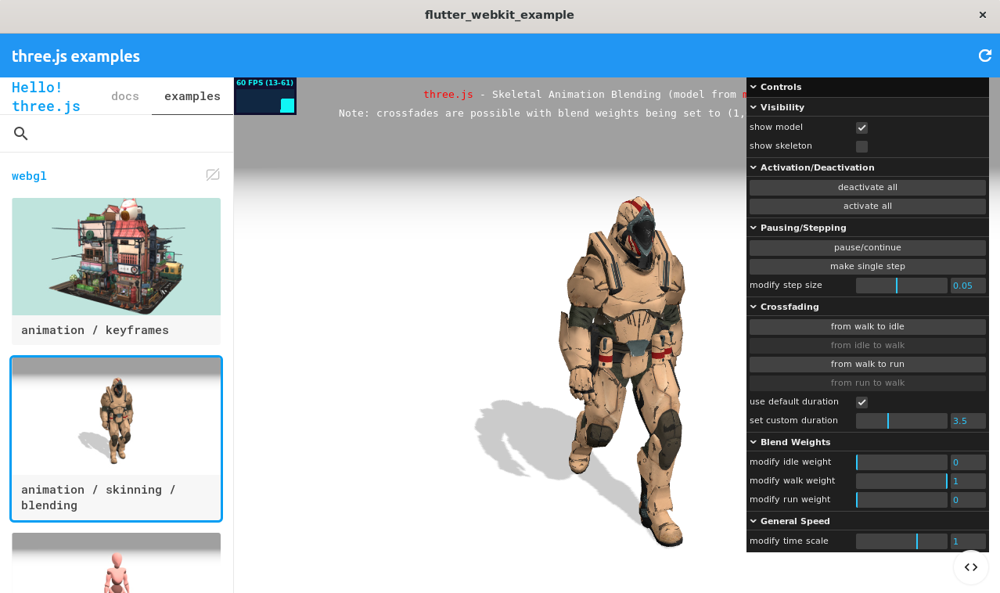

# flutter_webkit

Linux `WebView` widget backed by [WebKitGTK](https://webkitgtk.org/).



## Installing
Clone this repository or add as a Git submodule into your flutter project, and modify your `pubspec.yaml` by adding `flutter_webkit` to the `dependencies` section:
```yml
depedencies:
    flutter_webkit:
        path: plugins/flutter_webkit
```

Install WebKitGTK and dependencies:
```sh
sudo apt install libwebkit2gtk-4.1-dev
```
or if you are building on Ubuntu Focal:
```sh
sudo apt install libwebkit2gtk-4.0-dev
```

Modify `your_flutter_project/linux/my_application.cc` as follows:
```c
// ...

#include "flutter/generated_plugin_registrant.h"

// Add the following line:
#include "flutter_webkit/flutter_webkit_plugin.h" 

struct _MyApplication {
  GtkApplication parent_instance;
  char** dart_entrypoint_arguments;
};

// ...

  FlView* view = fl_view_new(project);
  // Add the following line:
  flutter_webkit_plugin_enable_overlay(GTK_WINDOW(window), view);
  gtk_widget_show(GTK_WIDGET(view));
  // Comment out the following line:
  //gtk_container_add(GTK_CONTAINER(window), GTK_WIDGET(view));

// ...
```

## Usage
```dart
import 'package:flutter/material.dart';
import 'package:flutter_webkit/webview.dart';

void main() {
  WidgetsFlutterBinding.ensureInitialized();
  runApp(const MyApp());
}

class MyApp extends StatefulWidget {
  const MyApp({super.key});

  @override
  State<MyApp> createState() => _MyAppState();
}

class _MyAppState extends State<MyApp> {
  late final WebViewController _controller;

  @override
  void initState() {
    super.initState();

    _controller = WebViewController(
      uri: "https://threejs.org",
      settings: WebViewSettings(
        enableDeveloperExtras: true,
      )
    );

    _controller.loadingStatusStream.listen((event) {
      debugPrint("Load state changed to '$event'.");
    });

    _controller.loadingStatusStream
        .where((element) => element == LoadEvent.finished)
        .listen((value) async {
      final val = await _controller.evaluateJavascript(
          "window.webkit.messageHandlers.onLoadComplete.postMessage({msg:'Hello from javascript.'});"
          "let e = document.querySelector('#header > h1 > span, a');"
          "if(e!=null) e.innerHTML = 'Hello! three.js';");
      debugPrint("js result: $val");
    });

    _controller.registerJavascriptCallback(
        "onLoadComplete", (data) => debugPrint("onLoadComplete: $data"));    
  }

  @override
  void dispose() {
    super.dispose();
    _controller.dispose();
  }

  @override
  Widget build(BuildContext context) {
    return MaterialApp(
      debugShowCheckedModeBanner: false,
      home: Scaffold(
        appBar: AppBar(
          title: StreamBuilder(
            builder: (context, snapshot) => Text(snapshot.data ?? ""),
            stream: _controller.titleStream,
          ),
          actions: <Widget>[
            IconButton(
              icon: const Icon(Icons.refresh),
              tooltip: 'Reload',
              onPressed: () {
                _controller.reload();
              },
            ),
            IconButton(
              icon: const Icon(Icons.search),
              tooltip: 'Inspect',
              onPressed: () {
                _controller.openInspector();
              },
            )
          ],
        ),
        body: Center(
          child: WebView(controller: _controller),
        ),
      ),
    );
  }
}
```